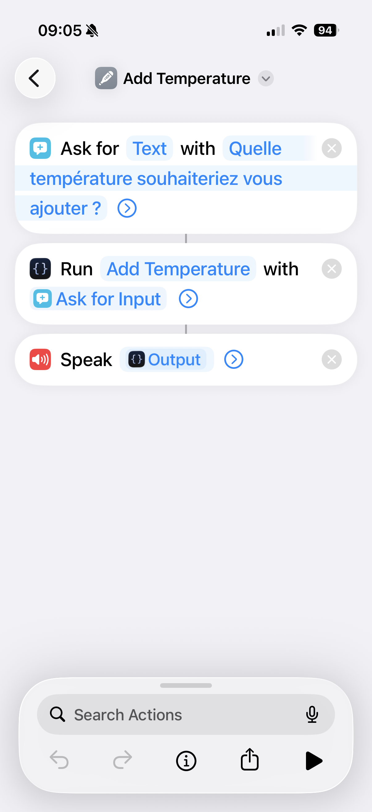

# BabyTracker Scriptable Shortcuts

Add Siri Shortcuts to **BabyTracker** using **Scriptable** and **Apple Shortcuts**.

This project currently provides a shortcut for quickly logging your baby's temperature directly from Siri, without opening the BabyTracker app.

## Requirements

You'll need the following apps installed on your iPhone:

* **BabyTracker**

  * https://babytrackers.com/babytracker_ios.html
  * http://itunes.apple.com/app/appName/id779656557
* **Scriptable**

  * https://scriptable.app
* **Apple Shortcuts**

  * https://apps.apple.com/us/app/shortcuts/id915249334

## Installation

Import the following scripts into Scriptable:

* `babytracker-setup.js`
* `babytracker-add-temperature.js`

## Initial Setup

Run the following script once:

```text
babytracker-setup.js
```

The setup wizard will ask for:

* BabyTracker email
* BabyTracker password
* Device UUID
* Native Token

These values are securely stored in the iOS Keychain and won't need to be entered again.

## Create the Shortcut

Create a new shortcut in the **Shortcuts** app with the following actions:

1. **Ask for Text**

   * Prompt: `What's the temperature?`

2. **Run Script**

   * Script: `babytracker-add-temperature.js`
   * Input: **Provided Input**

3. **Speak Text**

   * Speak the script output

Your shortcut should look similar to this:



## Example

Say:

> "Hey Siri, log a temperature."

Siri will ask:

> "What's the temperature?"

Answer:

> "37.4"

The script will record the temperature in BabyTracker and return:

> "Done! 37.4°C has been recorded for Louis."

## Security

Your BabyTracker credentials are **not stored in the script**.

They are securely saved in the **iOS Keychain** by the setup script.

## Disclaimer

This project is not affiliated with or endorsed by BabyTracker.

It relies on the APIs currently used by the iOS application and may require updates if those APIs change.
